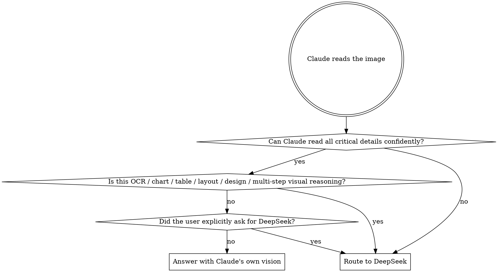

# DeepSeek Vision — Claude's External Visual System

DeepSeek vision is Claude's eyes for visual tasks beyond simple recognition. The core principle: **Claude formulates precise questions, not generic ones.** Don't ask "描述这张图片" — ask what you actually need to know.

**Output files** go to `~/.claude/deepseek-vision/output/`, never to Desktop or the user's working directory. Print results directly in conversation; save to file only when the user asks. Name files with a sequential number: `01_result.txt`, `02_result.txt`, etc. Check the directory to find the next available number before writing.

## Routing Decision



Claude states briefly: "我自己看了，……" when staying, or "我用DeepSeek看一下。" when routing.

### When NOT to Route

- **Code screenshots** — tracebacks, source code, diffs. Claude reads these well.
- **Plain text documents** — scanned contracts, book pages with clear text. Claude's OCR is sufficient.
- **Simple scenes** — "what's in this photo" with obvious subjects.
- **Screenshots Claude already read perfectly** — don't second-guess a confident, correct reading.

## Quick Reference

| Operation | Key Point |
|---|---|
| Launch browser | Persistent profile at `~/.claude/deepseek_browser_profile` |
| Switch mode | Click `[data-model-type="vision"]` selector |
| Upload image | `input[type="file"]` — first match |
| Type prompt | **Always `keyboard.type()`**, never `fill()` |
| Wait for reply | Poll `body.innerText` until stable for 4+ checks |
| Extract reply | Use `extract_reply()` to strip UI noise |
| Follow-up | Same page, image already uploaded, just type next question |
| Close | Only when visual investigation is **truly done** |

## Multi-turn Dialogue

When one answer isn't enough, continue the conversation in the same page:

1. Upload image, ask initial question, get response
2. Evaluate the response — is the visual issue resolved? Need more detail?
3. If not done: type a follow-up question (image is already uploaded), wait for response
4. Repeat until the visual issue is fully resolved
5. Close only when done

**Do not combine unrelated dimensions into one prompt.** If the user asks about both "排版" and "数据验算", do them as separate rounds. One dimension per round produces better answers.

**Do not close the browser just because one answer looked adequate.** Evaluate each response against the user's full request before deciding to close.

## Recipe

Execute each step interactively. Don't write a monolithic script.

### Step 1: Launch browser and open DeepSeek

```python
from playwright.sync_api import sync_playwright
from pathlib import Path

PROFILE = Path.home() / ".claude" / "deepseek_browser_profile"

p = sync_playwright().start()
ctx = p.chromium.launch_persistent_context(
    str(PROFILE),
    headless=True,
    args=["--disable-blink-features=AutomationControlled"],
    user_agent="Mozilla/5.0 (Windows NT 10.0; Win64; x64) AppleWebKit/537.36 Chrome/149.0.0.0 Safari/537.36",
    viewport={"width": 1920, "height": 1080},
    locale="zh-CN",
)
page = ctx.new_page()
page.add_init_script("""
    Object.defineProperty(navigator, 'webdriver', {get: () => undefined});
    window.chrome = {runtime: {}};
""")
page.goto("https://chat.deepseek.com/", wait_until="networkidle", timeout=30000)
page.wait_for_timeout(2000)
```

Check URL. If `sign_in`, tell user to manually login once with `headless=False`.

### Step 2: Switch to vision mode

```python
page.wait_for_selector('[data-model-type="vision"]', timeout=10000)
page.locator('[data-model-type="vision"]').click()
page.wait_for_timeout(500)
```

If the selector times out, take a screenshot and check if DeepSeek changed their UI. Look for an element with "识图" text or a vision-related icon as fallback.

### Step 3: Upload image

```python
page.locator('input[type="file"]').first.set_input_files(str(Path(image_path).resolve()))
page.wait_for_timeout(2000)
```

### Step 4: Send prompt

**Use `keyboard.type()`** — `textarea.fill()` doesn't trigger React onChange.

```python
import time
textarea = page.locator("textarea").first
textarea.click()
time.sleep(0.5)
page.keyboard.type(prompt, delay=30)
time.sleep(0.5)
page.keyboard.press("Enter")
```

### Step 5: Wait for response

```python
time.sleep(2)
prev_len = 0; stable = 0; final = ""
for _ in range(90):
    time.sleep(2)
    try:
        t = page.evaluate("document.body.innerText")
    except:
        continue
    if len(t) > 100 and len(t) == prev_len:
        stable += 1
        if stable >= 4:
            final = t
            break
    else:
        stable = 0
    prev_len = len(t)
if not final:
    final = page.evaluate("document.body.innerText")
```

### Step 6: Extract and present

```python
def extract_reply(text):
    ui = {"新对话","快速模式","专家模式","识图模式","深度思考","智能搜索","联网搜索",
          "内容由 AI 生成，请仔细甄别","本回答由 AI 生成，内容仅供参考，请仔细甄别",
          "使用快速模式开始对话","使用专家模式开始对话","使用识图模式开始对话"}
    think_pref = ("分析用户请求","分析图片","分析这张图片","构建回复结构","完善语言",
                  "起草过程中的自我修正","最终输出生成","识别图片中的关键",
                  "根据识别出的内容","以清晰、结构化的方式","直接返回你的回答",
                  "已思考","思考中")
    clean = []
    for line in text.split("\n"):
        s = line.strip()
        if not s or s in ui or s.startswith(think_pref):
            continue
        if s.endswith(("：",":")) and len(s) < 40:
            continue
        if any(s.startswith(p) for p in ("类型：","主题：","关键元素","整体上下文",
                "详细分解","总结/功能","总结：","构建回复","完善语言","起草过程","最终输出")):
            continue
        clean.append(line)
    return "\n".join(clean).strip()

result = extract_reply(final)
print(result)
```

After printing, scan the output for leftover UI noise. If the `extract_reply` filters missed something (DeepSeek may add new UI text over time), update the filter sets.

### Step 7: Multi-turn follow-up

Same page, image already uploaded, just type the next question:

```python
textarea = page.locator("textarea").first
textarea.click()
time.sleep(0.3)
page.keyboard.type(follow_up_question, delay=30)
time.sleep(0.3)
page.keyboard.press("Enter")
# Go back to Step 5 to wait for response
```

Evaluate each response. Only close when the visual task is fully resolved:

```python
# When truly done:
ctx.close()
p.stop()
```

## Common Mistakes

| Mistake | Why It Happens | Fix |
|---|---|---|
| Using `fill()` instead of `keyboard.type()` | `fill()` is faster and more familiar | DeepSeek uses React — `fill()` doesn't trigger onChange. Always `keyboard.type()`. |
| Closing browser after one adequate answer | "Looks good enough" feeling | Check: did the user ask multiple things? Are all dimensions covered? If unsure, ask another follow-up. |
| Combining unrelated questions in one prompt | Speed — one round is faster than two | Split dimensions. "排版" and "数据验算" are separate rounds. One focused question gets a better answer. |
| Routing code screenshots to DeepSeek | "It's an image, so I should route" | Code/traceback screenshots are Claude's strength. Route only if text is genuinely illegible. |
| Forgetting to switch to vision mode | Rushing to upload | Step 2 is not optional. Without it, DeepSeek won't process the image. |
| Saving output files without being asked | Habit of writing results to files | Print in conversation. Save to file only when user explicitly requests it. |
| Not updating `extract_reply` filters | Assuming the current filter set is complete | Scan output for UI noise after each session. If DeepSeek added new UI text, update the filter sets. |

## Red Flags — STOP and Re-evaluate

- "I'll just combine both questions into one prompt"
- "That answer is probably good enough"
- "I don't need to check the output for UI noise"
- "I'll use fill() just this once, it should work"
- "This code screenshot might be clearer with DeepSeek"

**Any of these = re-read the relevant section above before proceeding.**

## Troubleshooting

- **sign_in redirect**: Profile not logged in. Run `headless=False` once, login manually, close.
- **Timeout on `[data-model-type="vision"]`**: DeepSeek UI changed. Take a screenshot, look for vision-related UI elements ("识图", eye icon). Update selector.
- **Timeout on file input**: Page may not have loaded fully. Add `page.wait_for_timeout(3000)` and retry.
- **Empty response**: Cloudflare challenge. Anti-detection in Step 1 is the fix.
- **Cookie expired (~1 week)**: Re-login with `headless=False`.
- **`extract_reply` returns garbage or empty string**: DeepSeek changed their UI text or thinking process labels. Print raw `final[:500]` to inspect, then update the filter sets in `extract_reply`.
